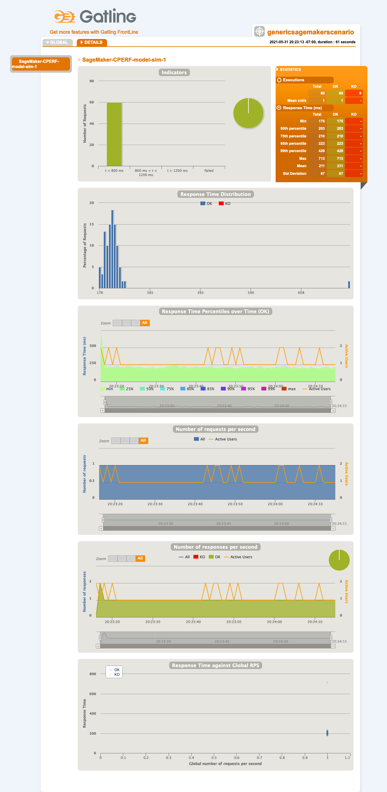

# sagemaker-gatling

[](https://github.com/intuit/sagemaker-gatling/actions/workflows/maven-build-push.yml)

`sagemaker-gatling` can run performance tests on your deployed AWS SageMaker endpoint.

This tool enables sending traffic by taking care of the request format required by SageMaker,
including authorization headers, hashing, signing, and other requirements. In addition, you can
specify desired traffic pattern by configuring options for ramp time, steady state time, TPS levels,
and more. Thus, you can send custom traffic patterns without needing to code anything. You just
need to give the sample request bodies and traffic configuration numbers.

Possible use cases:
- Run it as a jar file by itself, with configuration options for traffic level and durations.
- Include it as a dependency in other projects, like
  [perfsizesagemaker](https://github.com/intuit/perfsizesagemaker).
- Reference it as an example starting point for creating more customized scenarios.
  The project is implemented with
  [Gatling](https://gatling.io/),
  which is an open source Scala-based performance simulation tool with a
  [rich DSL](https://gatling.io/docs/current/cheat-sheet/)
  for performance script coding.

Note this tool does not change any deployment settings of SageMaker endpoints directly. It only
sends traffic (though the traffic can end up triggering auto scaling events).


## Usage

### Prerequisites

- Java JDK 1.8

### Execute fatjar

See details below for building and deploying the fatjar, but once it is available, you only need
Java to run it.

```sh
# Specify any needed config settings and results folder location:
java \
-Dauth.awsAccessKeyId=do-not-commit-to-git \
-Dauth.awsSecretAccessKey=do-not-commit-to-git \
-Dauth.awsSessionToken=do-not-commit-to-git \
-Dsagemaker.endpoint=CPERF-model-sim-1 \
-Dscenario.rampStartTps=0 \
-Dscenario.rampMinutes=0 \
-Dscenario.steadyStateTps=1 \
-Dscenario.steadyStateMinutes=1 \
-jar sagemaker-gatling-1.0-SNAPSHOT-fatjar.jar \
-s GenericSageMakerScenario \
-rf ./perfResults
```

See maven example below for sample output.

### Sample Jenkinsfile

Another usage option is to host a job on Jenkins that enables users to run perf tests.

See
[JenkinsfilePerfTest](JenkinsfilePerfTest)
as an example.


## Development

### Prerequisites

- Java JDK 1.8
- Maven

### Quick Start
```sh
git clone https://github.com/intuit/sagemaker-gatling.git

cd sagemaker-gatling

mvn clean package gatling:test -f pom.xml \
-Dgatling.simulationClass=GenericSageMakerScenario \
-Dauth.awsAccessKeyId=do-not-commit-to-git \
-Dauth.awsSecretAccessKey=do-not-commit-to-git \
-Dauth.awsSessionToken=do-not-commit-to-git \
-Dsagemaker.endpoint=CPERF-model-sim-1 \
-Dscenario.rampStartTps=0 \
-Dscenario.rampMinutes=0 \
-Dscenario.steadyStateTps=1 \
-Dscenario.steadyStateMinutes=1
```

See [application.conf](src/test/resources/application.conf) for more details on each option, and an
option for specifying request bodies.

### Sample Output
...
```
20:23:12.907 [INFO ] FileWeightDistribution - fileWeightJson: [
    {
      "path": "bodies/model-sim/1/status-200.input.json",
      "weight": 100
    }
  ]
20:23:12.941 [INFO ] FileWeightDistribution - fileWeightList: List(FileWeight(bodies/model-sim/1/status-200.input.json,100))
20:23:12.944 [INFO ] FileHelper$ - Unable to find file bodies/model-sim/1/status-200.input.json, so try finding as resource.
20:23:12.944 [INFO ] FileHelper$ - Found file as resource /bodies/model-sim/1/status-200.input.json
20:23:12.953 [INFO ] FileWeightDistribution - Verified file is accessible: bodies/model-sim/1/status-200.input.json
20:23:13.468 [INFO ] i.g.h.e.HttpEngine - Start warm up
20:23:14.532 [INFO ] i.g.h.e.HttpEngine - Couldn't execute warm up request https://gatling.io: i.g.h.c.i.RequestTimeoutException: Request timeout to gatling.io/34.77.242.251:443 after 1000 ms
20:23:14.534 [INFO ] i.g.h.e.HttpEngine - Warm up done
Simulation GenericSageMakerScenario started...
20:23:14.570 [INFO ] i.g.c.s.w.ConsoleDataWriter - Initializing
20:23:14.571 [INFO ] i.g.c.s.w.LogFileDataWriter - Initializing
20:23:14.578 [INFO ] i.g.c.s.w.ConsoleDataWriter - Initialized
20:23:14.583 [INFO ] i.g.c.s.w.LogFileDataWriter - Initialized

================================================================================
2021-05-31 20:23:19                                           5s elapsed
---- Requests ------------------------------------------------------------------
> Global                                                   (OK=4      KO=0     )
> SageMaker-CPERF-model-sim-1                              (OK=4      KO=0     )

---- SageMaker -----------------------------------------------------------------
[####                                                                      ]  6%
          waiting: 56     / active: 0      / done: 4     
================================================================================
```
...
```
================================================================================
2021-05-31 20:24:14                                          60s elapsed
---- Requests ------------------------------------------------------------------
> Global                                                   (OK=60     KO=0     )
> SageMaker-CPERF-model-sim-1                              (OK=60     KO=0     )

---- SageMaker -----------------------------------------------------------------
[##########################################################################]100%
          waiting: 0      / active: 0      / done: 60    
================================================================================

20:24:14.824 [INFO ] i.g.c.c.Controller - StatsEngineStopped
Simulation GenericSageMakerScenario completed in 60 seconds
Parsing log file(s)...
```
...
```
Parsing log file(s) done
Generating reports...

================================================================================
---- Global Information --------------------------------------------------------
> request count                                         60 (OK=60     KO=0     )
> min response time                                    175 (OK=175    KO=-     )
> max response time                                    713 (OK=713    KO=-     )
> mean response time                                   211 (OK=211    KO=-     )
> std deviation                                         67 (OK=67     KO=-     )
> response time 50th percentile                        203 (OK=203    KO=-     )
> response time 75th percentile                        210 (OK=210    KO=-     )
> response time 95th percentile                        223 (OK=223    KO=-     )
> response time 99th percentile                        429 (OK=429    KO=-     )
> mean requests/sec                                      1 (OK=1      KO=-     )
---- Response Time Distribution ------------------------------------------------
> t < 800 ms                                            60 (100%)
> 800 ms < t < 1200 ms                                   0 (  0%)
> t > 1200 ms                                            0 (  0%)
> failed                                                 0 (  0%)
================================================================================

Reports generated in 0s.
Please open the following file: sagemaker-gatling/target/gatling/genericsagemakerscenario-20210601032313163/index.html
[INFO] ------------------------------------------------------------------------
[INFO] BUILD SUCCESS
[INFO] ------------------------------------------------------------------------
[INFO] Total time:  01:39 min
[INFO] Finished at: 2021-05-31T20:24:15-07:00
[INFO] ------------------------------------------------------------------------

Process finished with exit code 0
```

### Sample Gatling Report

#### Global Information

The top level index.html file summarizes statistics across all request types (may be more useful
in cases where there is a mix of request types).


#### Details

Clicking on the Details tab shows statistics by request type.



### IDE setup

Any IDE should be fine.

For IntelliJ IDEA Community Edition:

- File > New > Project From Existing Sources...
- Navigate to this project directory.
- Select Maven and JDK 1.8 runtimes in the setup wizard.
- Project should compile and be ready to debug.

### Build

```sh
mvn package
```

The build process creates 3 files:
- sagemaker-gatling-1.0-SNAPSHOT.jar
- sagemaker-gatling-1.0-SNAPSHOT-shaded.jar
- sagemaker-gatling-1.0-SNAPSHOT-fatjar.jar

The first jar file contains just the compiled artifacts from this project.

The -shaded.jar contains additional classes embedded to make it usable by Frontline, which is an
optional service you can also use to run these tests.

The -fatjar.jar is even bigger and has all necessary dependencies included.  You can run this file
by itself with just Java (no need for resolving Maven dependencies).
[perfsize-sagemaker](https://github.com/intuit/perfsize-sagemaker)
uses a fatjar like this one for sending traffic loads.

### Deploy fatjar

See Release process below.


## Release

Update the version in [pom.xml](pom.xml) as needed (RELEASE vs SNAPSHOT build).

Create a new GitHub Release with a tag version as `v#.#` to correspond to the RELEASE version,
or `v#.#-SNAPSHOT-timestamp` for a unique SNAPSHOT tag.

GitHub Action [maven-build-push.yml](.github/workflows/maven-build-push.yml) will then package
the build artifacts and deploy them to the GitHub Packages Maven repository.  TODO: In the future,
will also deploy to the Maven Central repository.


## Contributing

Feel free to open an
[issue](https://github.com/intuit/sagemaker-gatling/issues)
or
[pull request](https://github.com/intuit/sagemaker-gatling/pulls)!

Make sure to read our [code of conduct](CODE_OF_CONDUCT.md).


## License

This project is licensed under the terms of the [Apache License 2.0](LICENSE).
